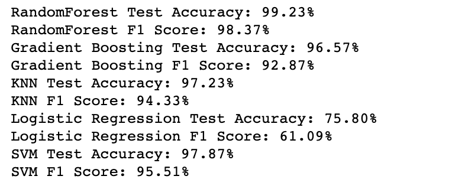
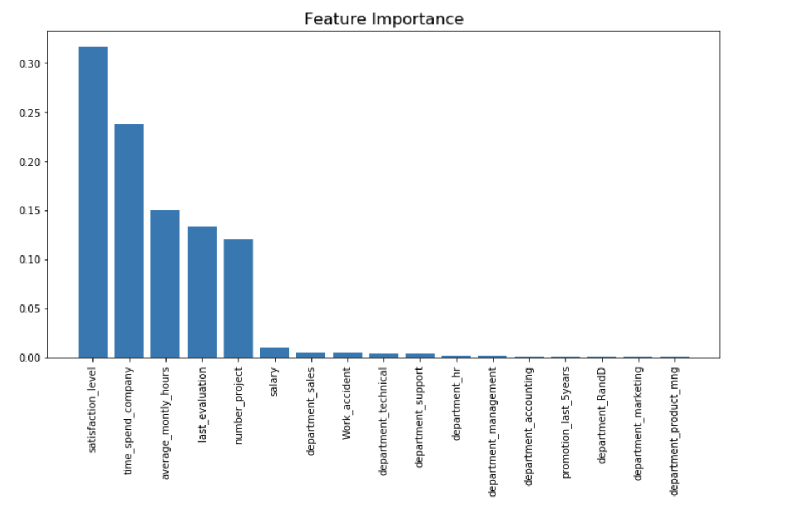

## Employee Turnover

I will be covering my analysis and approach through different process flows in the data science **pipeline**, which includes **statistical inference and exploratory data analysis**. The main goal is to understand the **reasoning behind employee turnover** and to come up with a model to classify an employee’s risk of attrition. A recommendation for a retention plan was created, which incorporates some best practices for employee retention at different risk levels of attrition.

The dataset can be found in the same directory HR_comma_sep.csv and includes following features:

### Steps Involved:

**Data Exploration**: perform bivariate analysis and observed Satisfcation level , work accident, time spend , salary are factors for employee turnover that can classify data.

**Statistics Test**: T test to check difference in Satisfaction level mean of the employee who had turnover and who had not turnover

**Data Preprocessing**: Converting the categorcial to ordinal & one hot encoded . Also handled imbalanced dataset by upsampling and downsampling

**Model Training**: Used pipeline for hyperparam tuning of different classifiers. Training different classification models-Random forest, Gradient Boosting, KNN , SVC and Logistic Regression using pipelines.

**Evaluation**: Comparing the accuracy and f1 scores for different models to select the most suitable one
**Conclusions**: Choosing the best model with appropriate reasons

**final results:**

**Feature importance:**

**Evaluation and Conclusions**
- Employee **satisfaction** is the **highest indicator** for employee turnover
- Employee **satisfaction, time spend in company,yearsAtCompany, and evaluation** were the four biggest factors in determining turnover.
- Based on above model to improve Employee Turnover Manger should focus on priorly satisfaction, time spend in company, yearsAtCompany, and evaluation of employee.

Please read the note book for information about the data and implementation of classifiers used.

[Notebook](https://github.com/utkarshut/ML-Projects/blob/master/Employee%20Turnover/employee_trurnover.ipynb)
