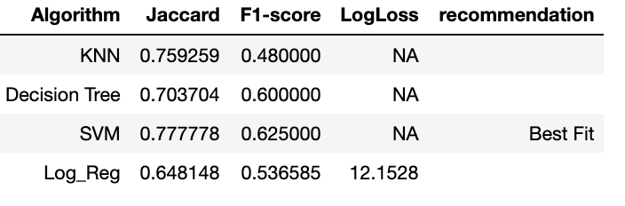

# IBM_watson_loan_best_classifier_project

Final project of IBM's course https://www.coursera.org/learn/machine-learning-with-python on coursera

A simple comparison between Logistic Regression,SVM , Decision Tree and KNN models on a given data set of loans records. final results:

# Conclusion
SVM has the best fit with 77% test accuracy and F1 score of .62

Please read the note book for information about the data and implementation of classifiers used.
